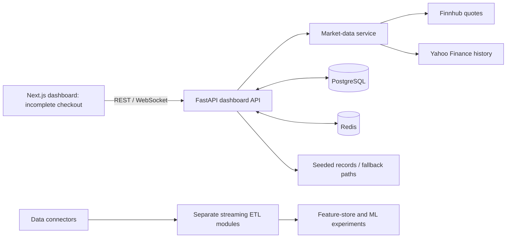

# QuantStream Analytics Platform

A financial-dashboard and data-engineering prototype combining a Next.js interface, a FastAPI API, market-data adapters, PostgreSQL, and Redis.

QuantStream explores how market quotes, historical candles, portfolio records, technical indicators, and operational metrics can be presented through one application. The repository also contains separate ingestion, streaming ETL, feature-store, and machine-learning experiments.

**Checkout status:** the dashboard frontend currently imports modules that are not tracked in this repository, including its shared API client, type definitions, and mock-data modules. A fresh clone is therefore not a complete runnable frontend. The architecture below describes the source components and their intended connections; it is not a claim of a healthy deployment.

[Architecture](#architecture) · [Backend setup](#backend-setup) · [Frontend status](#frontend-status) · [Code guide](#code-guide)

## Included components

| Component | What the source covers |
| --- | --- |
| Dashboard API | Authentication, market data, portfolio positions, alerts, and system metrics |
| Market adapters | Finnhub quote access and Yahoo Finance history requests |
| Dashboard UI | Market, portfolio, analysis, alerts, and settings pages |
| Persistence | PostgreSQL data access and Redis caching |
| Data engineering | Ingestion connectors, streaming transformations, and feature storage |
| Experiments | ML and infrastructure modules outside the main dashboard startup path |

The application mixes provider data with seeded portfolios and fallback/demo paths. A displayed chart or successful health response does not establish that all data is live or that every dependency is connected.

## Architecture



Finnhub and Yahoo are accessed by the backend service, not chained through each other. The streaming and ML modules should not be assumed to run merely because the dashboard API is started.

## Backend setup

Use Python 3.11, PostgreSQL, and Redis for the dashboard path. The root [requirements.txt](requirements.txt) is the API dependency list; [pyproject.toml](pyproject.toml) describes a broader experimental package with different dependencies.

```bash
git clone https://github.com/anudeepadi/QuantStream-Analytics-Platform.git
cd QuantStream-Analytics-Platform
python3 -m venv .venv
source .venv/bin/activate
python -m pip install -r requirements.txt
```

Provide the following environment variables through your local environment before starting the API:

| Variable | Purpose |
| --- | --- |
| `DATABASE_URL` | PostgreSQL connection to a development database |
| `REDIS_URL` | Redis connection |
| `FINNHUB_API_KEY` | Provider-backed quote access |
| `SECRET_KEY` | JWT signing secret; do not use the source fallback for deployment |

```bash
python -m uvicorn src.dashboard.backend.api.main:app --host 127.0.0.1 --port 8000 --reload
```

The database service creates tables and the app seeds demonstration records on an empty database. Use a dedicated development database. API documentation is at [localhost:8000/docs](http://localhost:8000/docs); health information is at `/health`.

## Frontend status

The frontend lives in [src/dashboard/frontend-next/](src/dashboard/frontend-next/) and uses a static Next.js export. Its configuration reads the API URL at build time.

Before it can build, restore the missing source modules referenced by imports, including:

- `lib/api/client` used by the tracked market-data API module.
- `lib/types/market-data` and `lib/mock-data/market` used by the same module.
- Other shared modules referenced by pages and components.

After restoring the complete source tree, configure `NEXT_PUBLIC_API_BASE_URL=http://localhost:8000`, install frontend dependencies, and use the package's `dev`, `type-check`, `lint`, and `build` scripts. The production output is `out/`; a static host is required rather than relying on `next start` for an exported site.

## Code guide

| Path | Responsibility |
| --- | --- |
| [src/dashboard/backend/api/main.py](src/dashboard/backend/api/main.py) | Lifecycle, dependency initialization, routes, and demo seeding |
| [src/dashboard/backend/api/endpoints/](src/dashboard/backend/api/endpoints/) | Dashboard HTTP/WebSocket handlers |
| [src/dashboard/backend/services/](src/dashboard/backend/services/) | Data, authentication, and provider access |
| [src/dashboard/frontend-next/](src/dashboard/frontend-next/) | Primary frontend source |
| [src/ingestion/](src/ingestion/) | Input connectors |
| [src/etl/](src/etl/) | Data transformations and streaming pipeline |
| [src/features/](src/features/) | Feature-store components |
| [infrastructure/](infrastructure/) | Infrastructure configuration and notes |

## Development boundaries

Review demo authentication and seeded users before any hosted use. The current authentication implementation uses salted PBKDF2 password hashes; older documentation describing bcrypt does not match that implementation. Missing frontend source, provider compatibility, infrastructure setup, and deployment acceptance require separate validation.

The repository contains tests and CI configuration, but this README does not claim that the broader experimental stack passes a fresh run. Changes should name the subsystem exercised and the dependencies required to reproduce the result.

## License

The package metadata declares MIT, but no standalone root license file is tracked. Clarify repository-wide licensing before distributing a release.
