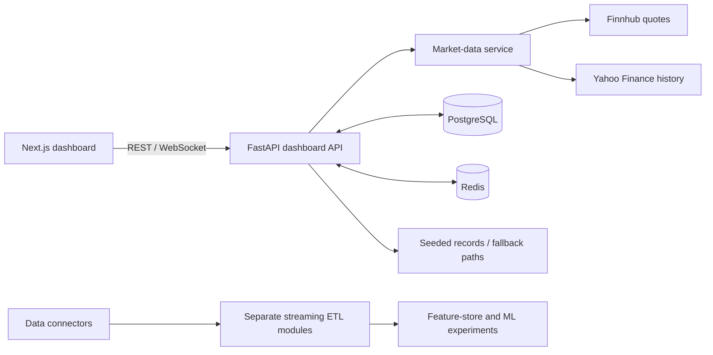

# QuantStream

A financial-dashboard and data-engineering prototype combining a Next.js interface, a FastAPI API, market-data adapters, PostgreSQL, and Redis.

QuantStream explores how market quotes, historical candles, portfolio records, technical indicators, and operational metrics can be presented through one application. The repository also contains separate ingestion, streaming ETL, feature-store, and machine-learning experiments.

**Status: development prototype.** The dashboard source is complete and its static export builds from a fresh checkout. The previously advertised Railway API returns 404; there is no verified end-to-end hosted demo. Use the local setup below.

[Architecture](#architecture) · [Backend setup](#backend-setup) · [Frontend status](#frontend-status) · [Code guide](#code-guide)

## Included components

| Component | What the source covers |
| --- | --- |
| Dashboard API | Authentication, market data, portfolio positions, alerts, and system metrics |
| Market adapters | Finnhub quote access and Yahoo Finance history requests |
| Dashboard UI | Market, portfolio, analysis, alerts, and settings pages |
| Persistence | PostgreSQL data access and Redis caching |
| Data engineering | Ingestion connectors, streaming transformations, and feature storage |
| Experiments | ML and infrastructure modules outside the main dashboard startup path |

The application mixes provider data with seeded portfolios and fallback/demo paths. A displayed chart or successful health response does not establish that all data is live or that every dependency is connected.

## Architecture



Finnhub and Yahoo are accessed by the backend service, not chained through each other. The streaming and ML modules should not be assumed to run merely because the dashboard API is started.

## Backend setup

Use Python 3.11, PostgreSQL, and Redis for the dashboard path. The root [requirements.txt](requirements.txt) is the API dependency list; [pyproject.toml](pyproject.toml) describes a broader experimental package with different dependencies.

```bash
git clone https://github.com/anudeepadi/quantstream.git
cd quantstream
python3 -m venv .venv
source .venv/bin/activate
python -m pip install -r requirements.txt
```

Provide the following environment variables through your local environment before starting the API:

| Variable | Purpose |
| --- | --- |
| `DATABASE_URL` | PostgreSQL connection to a development database |
| `REDIS_URL` | Redis connection |
| `FINNHUB_API_KEY` | Provider-backed quote access |
| `SECRET_KEY` | JWT signing secret; do not use the source fallback for deployment |

```bash
python -m uvicorn src.dashboard.backend.api.main:app --host 127.0.0.1 --port 8000 --reload
```

The database service creates tables and the app seeds demonstration records on an empty database. Use a dedicated development database. API documentation is at [localhost:8000/docs](http://localhost:8000/docs); health information is at `/health`.

## Frontend status

The frontend lives in [src/dashboard/frontend-next/](src/dashboard/frontend-next/) and uses a static Next.js export. Its configuration reads the API URL at build time.

The API client, authentication, types, hooks, state and sample data are included. Use Node.js 20 or newer:

```bash
cd src/dashboard/frontend-next
npm ci
NEXT_PUBLIC_API_BASE_URL=http://localhost:8000 npm run dev
```

For a static build, run `npm run lint`, `npm run type-check`, and `npm run build:cf`. The output is `out/`; serve it through a static web server, not `next start`. API URLs are compiled at build time. `NEXT_PUBLIC_WS_BASE_URL` defaults to `ws://localhost:8000` and must use `wss://` for an HTTPS backend.

`NEXT_PUBLIC_USE_MOCK_DATA=true` enables sample responses in data hooks. It does not replace the authentication backend. Seeded portfolios, sample market data, and fallback paths are demonstration data; do not interpret them as investment results or live provider coverage.

## Checks and deployment

The backend checks cover ingestion, feature-store and local Spark transformations. They do not require provider API calls or a cloud deployment. Use Python 3.11 and Java 17:

```bash
python -m pip install -r requirements-test.txt
python -m pytest tests/ingestion/unit/ tests/etl/ tests/features/ tests/ml/unit/ \
  -o addopts= --asyncio-mode=auto --timeout=90 -v
```

CI runs the same suite plus frontend lint, type checking and static export. These checks do not establish that PostgreSQL, Redis, streaming infrastructure or market providers work in a hosted environment.

Deployment jobs require the repository variable `ENABLE_DEPLOYMENTS=true`, configured Railway and Cloudflare credentials, a database, Redis, and the correct public API URL. The variable is intentionally opt-in; ordinary code/documentation merges still run every check. Restore and verify the backend before enabling deployment or advertising a live demo.

## Code guide

| Path | Responsibility |
| --- | --- |
| [src/dashboard/backend/api/main.py](src/dashboard/backend/api/main.py) | Lifecycle, dependency initialization, routes, and demo seeding |
| [src/dashboard/backend/api/endpoints/](src/dashboard/backend/api/endpoints/) | Dashboard HTTP/WebSocket handlers |
| [src/dashboard/backend/services/](src/dashboard/backend/services/) | Data, authentication, and provider access |
| [src/dashboard/frontend-next/](src/dashboard/frontend-next/) | Primary frontend source |
| [src/ingestion/](src/ingestion/) | Input connectors |
| [src/etl/](src/etl/) | Data transformations and streaming pipeline |
| [src/features/](src/features/) | Feature-store components |
| [infrastructure/](infrastructure/) | Infrastructure configuration and notes |

## Development boundaries

Review demo authentication and seeded users before any hosted use. The current authentication implementation uses salted PBKDF2 password hashes; older documentation describing bcrypt does not match that implementation. Provider compatibility, infrastructure setup, and deployment acceptance require separate validation.

The test suites above exercise their named subsystems. They do not validate the untested experimental ML stack, production scalability, or trading suitability.

## License

The package metadata declares MIT, but no standalone root license file is tracked. Clarify repository-wide licensing before distributing a release.
